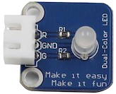

# Raspberry Pi 3 :: Sonic Voulme Adjustment 🔊

A little RPi3 project. Having some fun with RPi3, sensors and ES6/Node.js

## Breadboard / Wiring / Physics / Math


Basically, these are two components: Dual-Color LED + Ultrasonic Ranging Sensor wired together. LED colours mix (red & green) and brightness controlled by [PWM](https://en.wikipedia.org/wiki/Pulse-width_modulation), Ultrasonic Ranging Module sends sound impulses and gets the echo (low level) so knowing the time difference between sending and recieving signal we could calculate the distance `distance = (high level time * velocity of sound) / 2`[1] (actually the speed of sound [depends on the air temperature](http://hyperphysics.phy-astr.gsu.edu/hbase/Sound/souspe.html) [and other factors], but for purposes of simplicity I assume that it is a constant - 343.59 m/s, as for 20°C). After calculating the distance we have to convert the number of `cm` to the `dB` in range accepted by [amixer](https://linux.die.net/man/1/amixer) command (-2400 — 400 for -24dB - 4dB). To do so I'll use [Range Mapping](http://rosettacode.org/wiki/Map_range) implementet in [linear-conversion](https://github.com/javiercejudo/linear-conversion) library. And as the result we call a shell command `amixer cset numid=1 -- <volume>` setting the output volume of the speaker cnnected through 3.5mm stereo jack. And voilà: you've got yourself a sonic voulme adjustment system.

[1] Constant 2 here, means sound does a double path (from and than back to the module, being reflected from the obstacle)
x
**Components closer look:**

 

## Usage

```
# First: Run mplayer with any station (See: Links)
mplayer -playlist http://s7.nexuscast.com/tunein/247christmasheaven.pls

# Second: run the script. Note the sudo:
sudo node index.js

# Third: adjust the volume with your hand (~ 30sm above the sensor)
# Option 1: wave on desired height
# Option 2: put your hand above the sensor and move it up & down
#
# DONE! :)
```

## Links

**Radio Stations**

[](http://tunein.com)

[](https://shoutcast.com)

[](http://www.radio.net)

**Semantic Commits**

* [git-semantic-commits](https://github.com/fteem/git-semantic-commits)
* [Semantic commit messages](https://seesparkbox.com/foundry/semantic_commit_messages)
